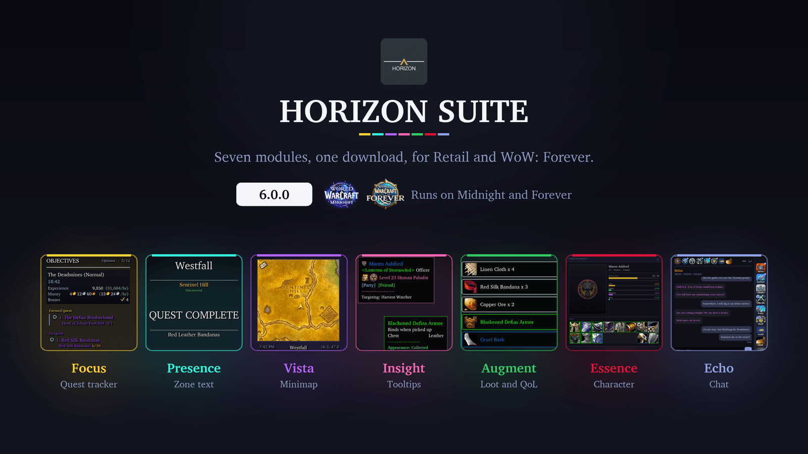
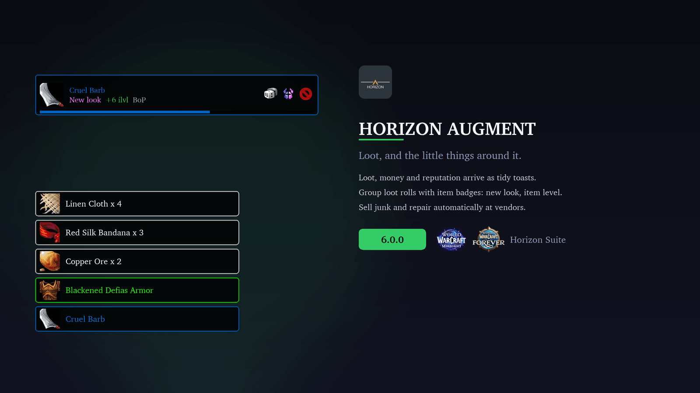
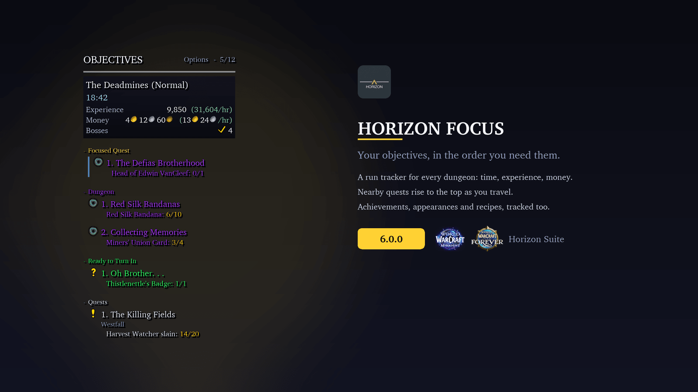
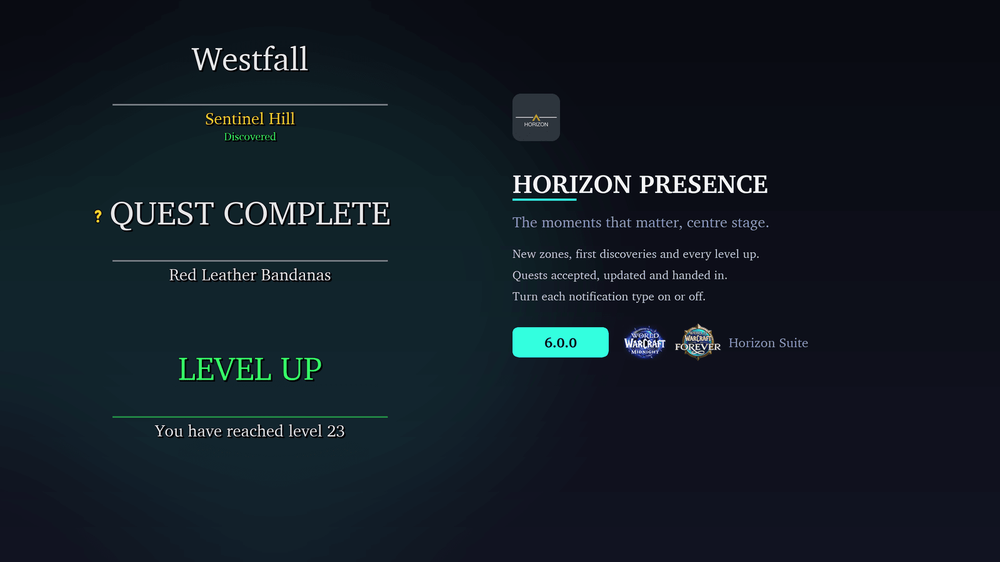
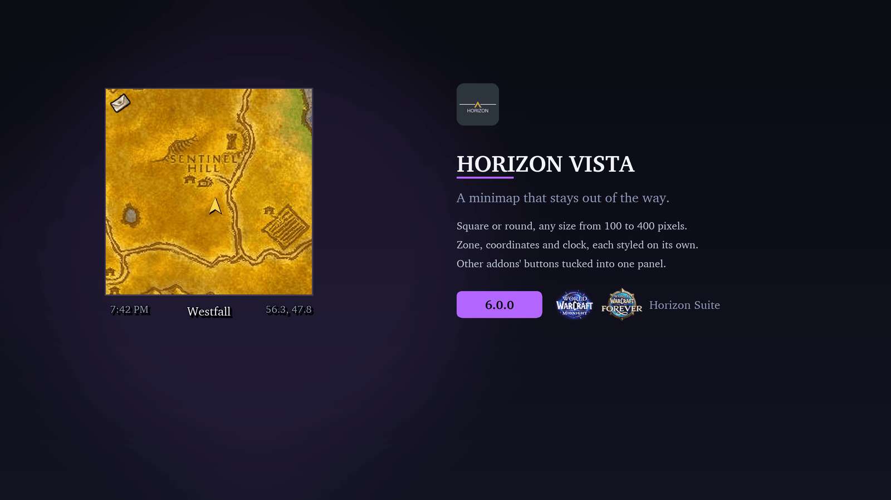
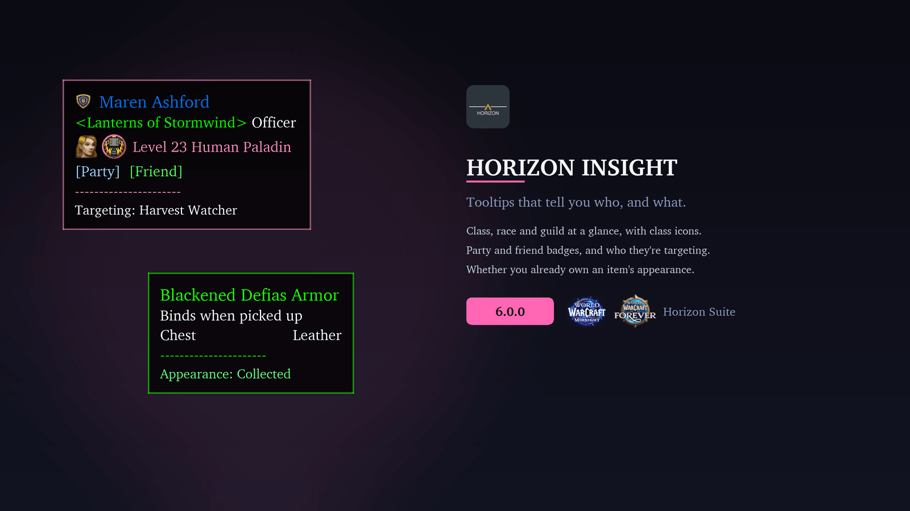
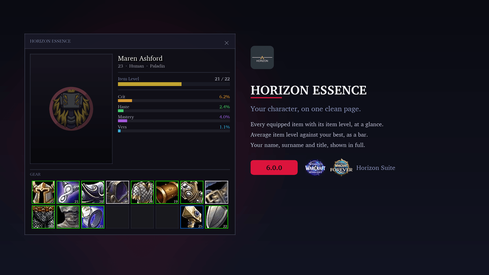
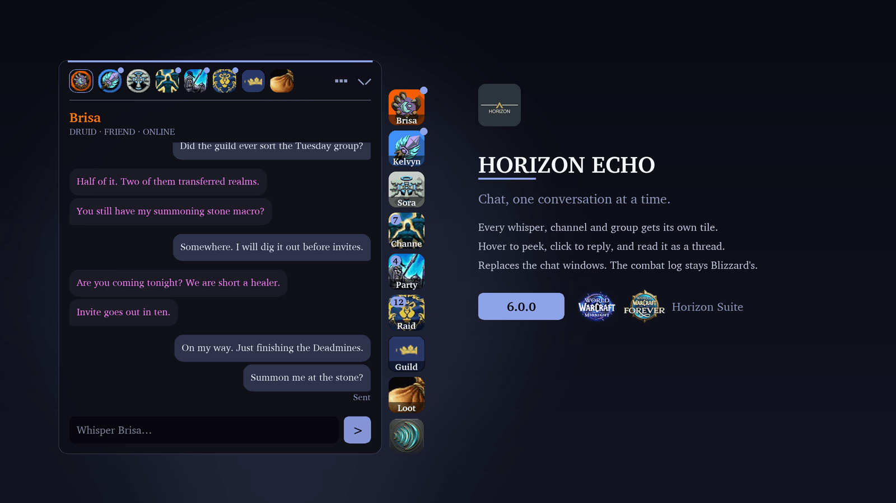

# Horizon Suite

Driven by the community and customised for each member's sensibilities.

# 

### Current Versions

_since-black?style=for-the-badge&logo=github&logoColor=0FBF3E&logoSize=auto)

Seven modules, one download, for **Retail (Midnight) and WoW: Forever**. Each module switches on or off on its own, so you only run the parts you want. A fresh install starts with every module off: pick yours under **Axis → Modules** and reload.

**New in 6.0:** **Echo**, a chat module that gives every conversation its own tile. See below.

***

## 🌐 Retail and WoW: Forever

Horizon Suite runs on Retail (Midnight) and the WoW: Forever beta from the same download: install it once and every module loads on either client. Forever has no Mythic+, Delves, housing, Great Vault, specialisations or Traveler's Log, so the settings for those stay out of the way there.

Known beta issue: the Forever client doesn't yet read saved settings back at login, so your settings reset on reload there until Blizzard fixes it.

***

## 🎒 Augment \[Miscellaneous\]

Quality-of-life improvements to Blizzard's own UI, starting with loot that deserves to be seen.

*   **Loot toasts:** Items, money, currency and reputation slide in with quality colours and smooth animations. Epic and legendary drops stay on screen longer, with a shine and an optional sound. Choose Compact, Framed, Accent, Ribbon, Rail or Card styling (shared with alerts, loot rolls and Echo; Card adds item level and slot under each item), which side the icon and slide-in sit on, and which way the stack grows. With Auto Loot off, Blizzard's loot window picks up the same style.
*   **Loot rolls:** Horizon's own Need and Greed frames, matching your loot toast style by default. While the timer runs they show who has rolled and who is leading, whether the appearance is new to you, how the item level compares with what you're wearing, and whether it binds on pickup. Rolls below a quality you choose keep Blizzard's frame, so no roll goes missing. Off by default, and you can try a demo without a group.
*   **Alerts:** Optional toasts for Great Vault rewards, low durability, nearly full bags, new mail, and friends coming online or going offline. Every kind starts off, so you switch on only the ones you want, each with its own threshold and colour.
*   **Auto Vendor:** Sells your grey items when you open a merchant, with optional rules for unusable and low-level gear. Automatic repairs, from your own gold or the guild bank, are available but off by default.
*   **Talking Head:** Restyles the NPC dialogue frame, with options to hide the portrait or mute the voice-over.
*   **Self Highlight:** Uses Blizzard's "find yourself" outline, circle or icon, in combat, and optionally whenever you target an enemy. Off by default.
*   **Achievement Tracker:** Removes achievements from your tracked list as soon as you earn them. Off by default.

***

## 🎯 Focus \[Objective Tracker\]

Your tracker shouldn't need babysitting. Focus keeps up with you: it surfaces nearby quests, updates as you move, and gets out of the way when you don't need it.

*   **Always relevant:** Nearby quests rise to the top, and the list reorganises when you change zone. Delves, scenarios, raids and world events get their own sections with live progress bars and timers. Zone event quests appear under Events in Zone before you arrive and move to Current Event once you're inside.
*   **Proximity and auto-focus:** Sort each section closest-first, and optionally super-track the nearest quest automatically. Toggle auto-focus with a key binding.
*   **Tracks everything:** Achievements with full criteria progress, Endeavors and Decor for housing, transmog appearances, profession recipes and Traveler's Log objectives. One click opens the matching Blizzard panel.
*   **Recipe shopping lists:** Tracked recipes list the reagents you need. Full reagent detail adds optional and finishing reagents. With [Auctionator](https://www.curseforge.com/wow/addons/auctionator) and the Auction House open, the magnifying glass runs a shopping search; right-click it to multiply every quantity by the number of crafts you want.
*   **Mythic+ (Retail):** A banner with the dungeon and key level, your timer against the limit with deaths and their time penalty, the time left for +3, +2 and +1, an enemy forces bar, the week's affixes and each boss.
*   **Dungeon run tracker:** In any party dungeon that isn't a keystone run, a banner shows time inside, experience and gold earned, and the rate of each per hour. Hover it for the bosses you've killed, how long the next level will take at your current pace, and a button to start the run over. The run survives a reload and picks up again after a corpse run.
*   **Delves and Prey (Retail):** Delve objectives in the standard layout, and Midnight's hunting activities in their own Prey section.
*   **Rare alerts:** Super-track nearby rares with one click, with optional sound cues.
*   **Live quest sync:** World quests, dailies and weeklies update as they change, and quests track themselves when you accept them. Countdown timers switch on separately for scenarios, world quests, and dailies and weeklies.
*   **Your layout, your rules:** Show, fade or hide in combat; show or hide in dungeons, raids and battlegrounds; compact or minimal layouts; show on mouseover only. Choose how clicks behave, down to your own combinations.
*   **Profiles:** Per character, per specialisation or global. Create, copy, and share them as text strings.

***

## 🎬 Presence \[Cinematic Notifications\]

Blizzard's zone text does the job. Presence makes it feel like a moment.

*   **13 notification types:** Zone and subzone changes, level-ups, boss emotes, achievements, quest and world quest updates, and scenario and Delve progress arrive as styled toasts, with an optional "Discovered!" line on your first visit.
*   **Smart queue:** Up to five notifications wait while one plays. Level-ups and boss emotes jump the queue.
*   **Quiet when it matters:** Silence zone, quest and scenario chatter during a key, and hide objective popups inside Delves while keeping entry and completion toasts.
*   **Per-type toggles:** Keep only the notifications you care about. Switch off zone names, achievements or world quests and Blizzard's own versions come straight back.
*   **Fully adjustable:** Position, scale, fonts and sizes for title and subtitle, animation speed and hold time.

***

## 🗺️ Vista \[Minimap\]

A minimap that fits your UI, not the other way round.

*   **Square or circular:** Drag it anywhere, lock it, and resize it from 100 to 400 px. Mouse-wheel zoom, with an optional automatic zoom-out.
*   **Opacity:** Fade the minimap in the open world and further in combat; hovering brings it back to full.
*   **Zone text, coordinates, clock and FPS/latency:** Each has its own font, size and colour, and can be hidden. Click the clock for the stopwatch.
*   **Instance info:** Difficulty and Mythic+ key level appear automatically inside instances.
*   **Addon button collector:** Gathers other addons' minimap buttons into a mouseover bar, right-click panel or floating drawer, with a per-addon filter.
*   **Built-in controls:** Tracking, calendar, mail and queue indicators, each movable and shown always or on mouseover.
*   **Typography and colour:** Border thickness, panel colours, fonts, and SharedMedia support.

***

## 🔍 Insight \[Tooltips\]

Tooltips that tell you who you're looking at.

*   **Class-coloured names and borders** for players at a glance.
*   **Spec, hero talent, role, faction and PvP title** without having to inspect anyone.
*   **Item level and Mythic+ score**, with the rating coloured by tier.
*   **Mount identification:** Hover a mounted player to see the mount, its source and whether you own it.
*   **Transmog status:** Item tooltips show whether you've collected the appearance.
*   **Cinematic presentation:** Dark backdrop, fade-in, and a cursor or fixed anchor. Optionally closes styled tooltips during combat.

***

## 🛡️ Essence \[Character Panel\] \[PREVIEW\]

A character sheet built to match the rest of your Horizon UI. It replaces Blizzard's character frame on the C key.

*   **Gear grid:** Every equipped slot with its item level and a quality-coloured border.
*   **Item level bar:** Your equipped item level against the best you own.
*   **Secondary stats:** Crit, haste, mastery and versatility as bars beside a 3D model of your character.
*   **Spec and role:** Your specialisation and role icon on Retail.

**Preview:** Essence is still in early development, so expect rough edges and unfinished parts while we build it out. It's off by default.

***

## 💬 Echo \[Chat\]

Chat built around conversations instead of one long scroll. Every conversation gets its own tile at the edge of your screen: each person you whisper, Battle.net friends, party, raid, guild, your channels, and feeds for loot, progress and system messages.

*   **Peek or read:** Hover a tile to see the latest messages and reply on the spot, or click it to read the whole conversation as a thread.
*   **Nothing lost:** Whispers and guild chat are kept between sessions, and you can pin any message.
*   **Tidy channels:** Channels can share one tile, with a tab for each.
*   **Familiar where it counts:** Blizzard's own input line sits docked beneath Echo, so slash commands and replies work as before. The combat log stays Blizzard's.

While Echo is on it replaces Blizzard's chat windows, so it starts switched off.

***

## 🎨 Visuals & UI Design

*   **Colours:** Per-category colour control for titles, objectives, zones and sections. Panel backdrop colour and opacity, with an optional stronger backdrop and border on mouseover.
*   **Global Toggles (Axis):** Class tint for each module or all at once (dashboard, Focus, Presence, Vista, Insight, Augment and Essence). A global UI scale from 50% to 200%, or separate scales for Focus, Presence, Vista, Insight and Augment. Pick the settings window's background (flat, Midnight artwork, or your current spec's talent art), font and text size.
*   **Typography:** Fonts, sizes, outlines and spacing, with SharedMedia support for fonts from addon packs.
*   **Progress bars and timers:** An optional bar under objectives with numeric progress, for X/Y counts, percentages or both, in any SharedMedia texture. Timers sit below objectives, beside the title, or on their own line.
*   **Motion:** Smooth entry and exit animations, a pulse on completion, and optional scroll indicators when the list overflows.

***

## 📥 Addon Compatibility

*   [SharedMedia](https://www.curseforge.com/wow/addons/sharedmedia)
*   [RondoMedia](https://www.curseforge.com/wow/addons/rondomedia)
*   [ALL THE THINGS](https://www.curseforge.com/wow/addons/all-the-things)
*   [Auctionator](https://www.curseforge.com/wow/addons/auctionator)
*   [Total RP 3](https://www.curseforge.com/wow/addons/total-rp-3)
*   [World Quest Tracker](https://www.curseforge.com/wow/addons/world-quest-tracker)
*   [RareScanner](https://www.curseforge.com/wow/addons/rarescanner), with [Horizon Suite - RareScanner](https://www.curseforge.com/wow/addons/horizon-suite-rarescanner)
*   [SilverDragon](https://www.curseforge.com/wow/addons/silver-dragon), with [Horizon Suite - SilverDragon](https://www.curseforge.com/wow/addons/horizon-suite-silverdragon)

**Send us a message about which AddOns you'd like integrated into Horizon Suite!**

***

## 🤝 Community & Support

The more people that use Horizon Suite, the more feedback we have to drive the future of the AddOn. Horizon Suite would not be where it is without our lovely community.

**Thank you to everyone who supports us:** our translators, testers, Patreon and Ko-fi supporters, and everyone who shares feedback on Discord. Additional translations (starting or continuing) are always welcome!

***
